## Shell

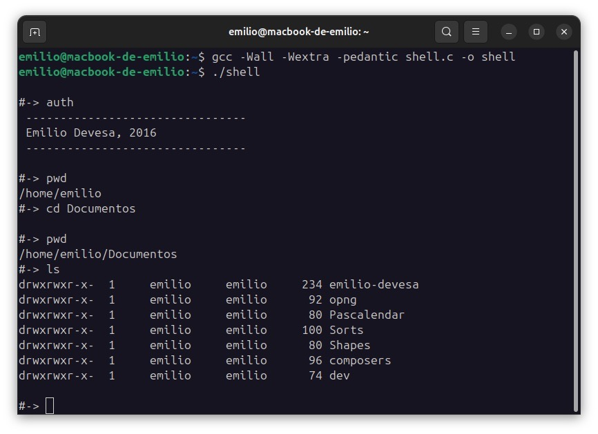

This program implements a shell for Linux written in C.

### Usage

Compilation is done with `gcc`, using the `-o` flag to specify the name of the executable we want to generate:
```
$ gcc shell.c -o shell
``` 
You can also use other useful flags:
```
$ gcc -Wall -Wextra -pedantic shell.c -o shell
```
And you can run the program by doing:
```
$ ./shell
```

### Development

A shell is nothing but a loop in which the prompt (for example `&>` or any other combination of characters) is displayed to indicate that it is waiting for a command to be entered.
We type the command, it gets executed, and then the shell waits again for the next one - unless that command ends the execution.

So, we're going to include the standard I/O library to enable reading and writing: `#include <stdio.h>`  
And we also create the `main` function. In its header, we usually specify an integer (`argc`) and an array of characters (`argv`). These refere to the number of arguments with which the program was invoked and the string used to invoke it.

For example, when I run a simple command from the terminal like:
```
$ ls /home/emilio
```
The integer has a value of 2 (the command and the path), and the character array stores the entire string - that is, `ls /home/emilio`.
If later on we need to separate the words within that string, that will be our responsibility.
```
void main (int argc, char * argv[])
{

  while (1)
  {
      printf("\n#->");
  }

}
```
Inside the `main` function, we'll of course create an infinite loop where, for now, the only thing it does is print a carriage return (that is, move to a new line) using `\n`, along with the prompt `#->` so the user knows he can type there. If you compile it and run it, you'll get this infinite loop.

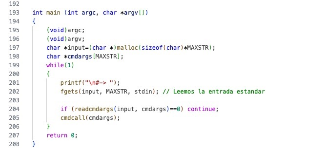

For now, we're going to implement the routines that read what the user types, without performing any operations yet, and just a single command - the exit command.

To read input, I'll use the `fgets` function (you can look it up, remember, with `man fgets`). Its interface is as follows:
```
char *fgets(char *s, int size, FILE *stream);
```
So `fgets` reads whatever arrives from the `*stream` into the buffer `s`, up to `size - 1` bytes - remember that the machine starts counting positions at zero.  
That's why I'm going to define a constant called `MAXSTR` which corresponds to the maximum size the shell will read, and a variable `input` where we'll store the read data. Note that I reserve the string's space with `malloc` (this helps avoid nasty buffer-overflow bugs). To check that it works, I can make the program echo back whatever I type by simply printing the `input` variable.

Now let's move on to "splitting" the string, to separate what will be commands from what will be arguments, etc. In `main`, we'll create a variable (outside the loop to avoid wasting memory) called `cmdargs`, which is an array of char pointers.

Since in C what is stored is actually a pointer to a memory address, we can make each of these pointers refer to a location where we can read a command and its arguments separately.

The splitting itself will be done by a function I created called `readcmdargs`, so that it's easy to understand and doesn't make `main` too messy. Inside this function, I take the `input` string and, using `strtok`, look for characters such as space, end-of-string, or tab. If none are found, the function returns `NULL`, which means the user didn't type anything, and our function will return 0. Otherwise, we'll count the pieces and store them in an array.

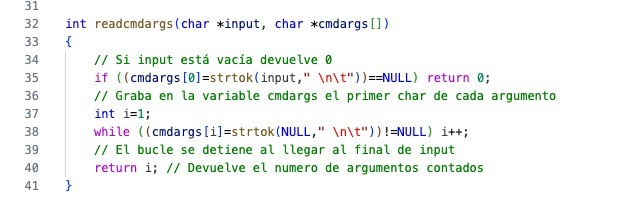

Once the function finishes, `main` checks whether there were zero pieces (that is, nothing was typed) or if there was some input.

Now we can check whether it matches a command we have implemented. To do this, I'll skip the `else` in the `if` in `main` (since if nothing was typed, nothing should happen) and directly call a function I'll define next, called `cmdcall`. This function is responsible for checking which command the user entered and then calling the corresponding function.

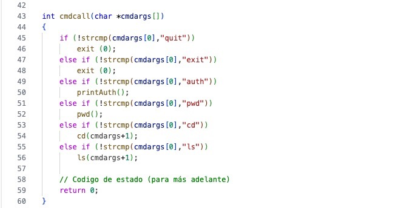

For now, I'll allow only two commands: the termination commands `quit` and `exit`. In this case, since terminarion requires no extra steps, we can directly invoke C's `exit()` function.

Next, we're going to implement a very simple procedure to display the author, and once we know how to do that, we'll create three more procedures that allow us to navigate the directory structure of our system and see which directory we're currently in.

First, we'll tackle the simplest procedure. I want that when the user types the command:
```
#-> auth
```
the program prints a small text with my name and the year I wrote this.

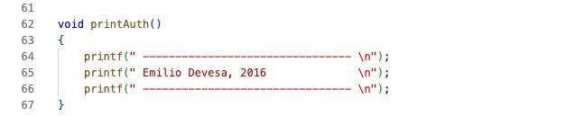

So, in our `cmdcall` function - where we distinguished which command the user entered - I'll define that if the command is `auth`, it calls the function `printAuth`. Simple, right? Now I can define the `printAuth` function, which is just a handful of `printf` statements.

Let’s move on to the two directory-related functions I want to implement. The first is `pwd`, which does exactly what the Linux command does: it shows the directory I’m currently in. The second is `cd`, and like the original, it allows me to change to another directory. I’m going to add them to my list of commands.

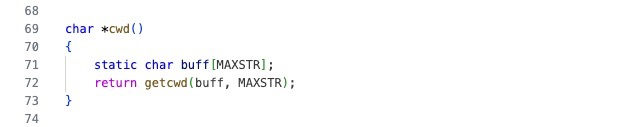

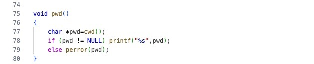

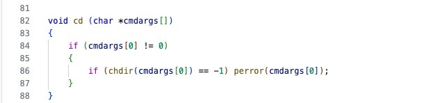

To implement them, I’ll first create an additional procedure that returns the string containing the path of the directory I’m currently in. I’ll call it `cwd` (short for _Current Working Directory_), and its implementation is very simple: I’ll create a character buffer (I’ll give it a maximum size to avoid problems) and call the `getcwd` function, which stores the local path in this buffer — again, up to the maximum number of characters we’ve defined.

Before continuing, take a look at the manual page for getcwd:
```
$ man getcwd
```
It belongs to a system library, so we'll need to import it at the top of the program:
```
#include <unistd.h>
```
Now that we can obtain the path using this function, implementing `pwd` is trivial. We simply store the result in a string and print its contents, nothing more. We just have to check that the function didn't return `NULL` or encounter an error; if it did, we send the message to the error output using `perror`.

Once that's done, let's move on to a slightly more involved function. I want the `cd` command to let me change directories - or do nothing if I don't provide a valid path or any path at all. In other words, the command syntax is:
```
#-> cd [a_path]
```
where the path argument may or may not be present. That's why, in `cmdcall`, we invoke `cd` with the rest of the user's input, because that's where the arguments will be. Let's implement it.

The procedure starts by checking whether there are any arguments. If there are, it means the user typed a path, and in that case, we call the `chdir` function (which luckily is also part of `<unistd.h>`) with that path. If the system can't change directories (because the path is invalid or an error occurs), we print an error message to the standard output.

A nice side effect of callling the function directly within the `if` that checks its result is that, if everything goes well, we don't need to do anything else.

Now let's get ready to list files.

First, I'll implement a couple of procedures that, given an user ID or a group ID, return the corresponding user or group name. The functions we'll need to call are `getgrgid()` and `getpwuid()`. If we check the manual (`man getgrgid` or `man getpwuid`), we'll see that both depend on the library `<sys/types.h>`, and then each one has its own specific header: `<grp.h>` and `<pwd.h>`.

The advantage of using the `man` documentation is that it also shows the prototype of the data structures these functions work with. That way, I can already see how groups and users are stored internally, and I know exactly which field of the structure I need to read.

So I import those libraries and implement two very simple, almost identical functions: I create a variable to access the corresponding structure, use the identifier received as an argument and try to retrieve it. If I get a `NULL` value, that means an error occurred; otherwise, I can return the field I'm interested in - `gr_name` for groups or `pw_name` for users.

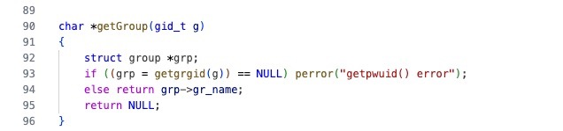

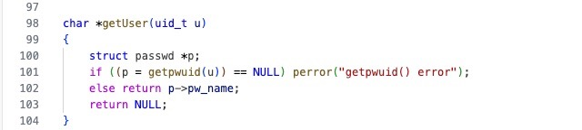

One of the most elegant aspects of UNIX design (and by extension, also of Linux, MacOS, etc.) is that **everything is a file**. A few control bytes are responsible for determining whether that file corresponds to a directory, a symbolic link, a pipe, a regular file, and so on. Other bytes define its **mode** - in other words, its access permissions.
You can see these control bytes when you do:
```
$ ls -l
```
The string is made up of eleven characters: one for the file type, nine for the pemissions, and the [Sticky bit](https://en.wikipedia.org/wiki/Sticky_bit) if it's a directory.

For now, let's forget about how to access the file's mode itself and assume it's passed to us as an argument. We'll make use of C's `&` (bitwise AND) operator to compare the first byte and determine what kind of file we're dealing with. This will return the corresponding char.
From another function, we'll obtain the rest of the characters that indicate the file's permissions and gradually build the formatted string called `mode`.

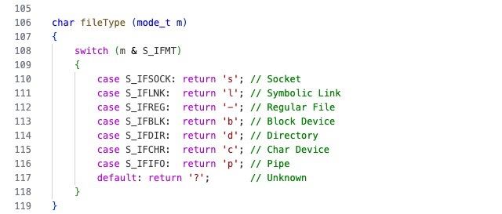

I create an empty string of 11 characters and fill it with hyphens. The first character is set by calling the `fileType` function we just wrote. The rest are simple checks to see which permissions are active. The last one is the **Sticky bit**, which - if enabled - is usually represented by a capital "`T`". In modern operating systems, the Sticky bit can actually convey more information when it appears on other positions or as a lowercase "`t`", but for simplicity, I'll keep it this way in this program. You can find much more about it in the Wikipedia article linked earlier.

Once that's done, the function returns the `mode` string ready to use.

Now, we already have enough tools to start filling in the information for each line of `ls`... except we still haven't accessed the files themselves to retrieve other properties - like their **name** or **size**, for instance.  
To do this, we'll rely on the `stat` function. You can find more information about it with:
```
$ man lstat
```
The functions we've written so far - and the ones we're about to add - require including the header `<sys/stat.h>`, so let's import it before we forget:
```
#include <sys/stat.h>
```
That’s if you’re working on Linux. Up to this point, our shell has also worked on macOS, but differences between the two systems (and the libraries they include or omit) mean that this man page isn’t available on Apple’s OS. You can find a MacOS compatible version of this shell in the `uShell`repository.

Anyway, the point is that `stat` allows us to access files through a **struct**, which is described in detail in the manual.

Let's write a procedure that builds the corresponding string, including the file's mode, the number of links to the element, the group, the owner, the size, and the file name.

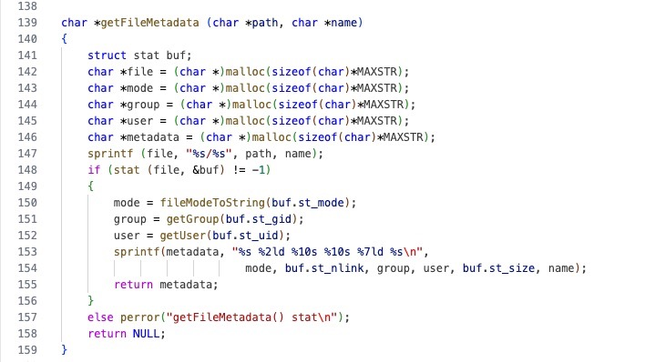

We start by creating a buffer called `buf`, which is a structure used to store the data obtained from `stat` when we handle the file. Next, we allocate space for the strings representing the mode, group, and user, as well as for the line called `metadata`, which will hold all these components concatenated together.

Then we use `sprintf` to write into the variable `file` the full path and filename (both passed as arguments to the procedure) in the form `path/name`. This gives us the absolute path, which we need in order to call `stat` on the file.

Once we've executed `stat`, we can access the fields `st_mode`, `st_gid`, and `st_uid`. These are the ones we'll pass to the functions we wrote earlier to retrieve the mode, group, and user as strings. After that, we simply use `sprintf` again to format the `metadata` string with all the information we want to display: 
```
sprintf(metadata, "%s %2ld %10s %10s %7ld %s\n", mode, buf.st_nlink, group, user, buf.st_size, name);
```

Obviously, the `%s` masks are for character strings. The first string is the file mode, which we include as is. Next comes an integer - the number of links pointing to that node in the filesystem. Since it's an integer, we use the `%d` mask, but I've added a `2` to reserve space for two digits and an `l` to right-align the numbers, so they line up neatly.

The same logic applies for `%10s`: it's a mask for printing a string within a 10-character field. For the file size, I've reserved 7 spaces, again right-aligned, using `%7ld`. And don't forget to include a newline character at the end: `\n`.

Once that's done, we can return the `metadata` string ready to display. With this, we have everything we need to access a file and print its information in a single line of text.

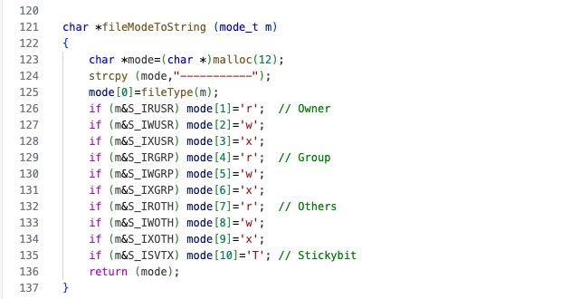

In Linux, we have functions like `opendir()` and `readdir()` to access a directory and its contents. As you can see in the manual, both functions depend on the `<dirent.h` library - so let's include it in our program.

The function `readdir()` returns a structure named `dirent` with all the information.

We get the user input as an argument, whether it is a path, the `s` flag (to print only the names of each element) and the `a` flag (in order to print all elements, including the hidden ones). We need to define the variables that will enable us to determine the desired options and path. Then, we will loop through the arguments with which `ls` has been invoked, in order to compare if the flags `-s` or `-a` were introduced and we set the corresponding variables to 1. If we find something else, it will be parsed as the path. If there is nothing more, we will use the `cwd` function to list the current directory.

The last part of the function is very easy to understand. We try to access the path (or raise an error if it is not possible). Now, each time we invoke `readdir()`, we will get the elements in the directory sequentially, so we can loop through them until we get `NULL`, meaning there are no more elements left.

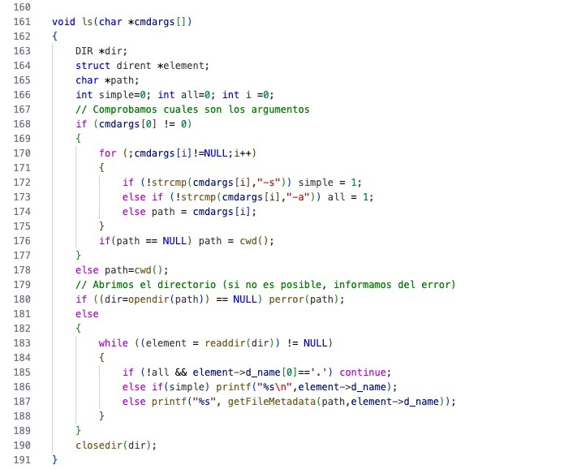

If the `all` variable is not activated, we use the `if` sentence to exclude the elements starting with a dot - that is: hidden files, links to current and parent directory). If the `simple` variable is not activated either, we only print the name of each element (accesible within the dirent structured). In the variable is activated, we use the function `getFileMetadata` to obtain the string with the permissions, group, owner, etc.

Once finished all the operations, we close the directory with `closedir()`.

We can now add `ls` to the list of commands available in our shell.

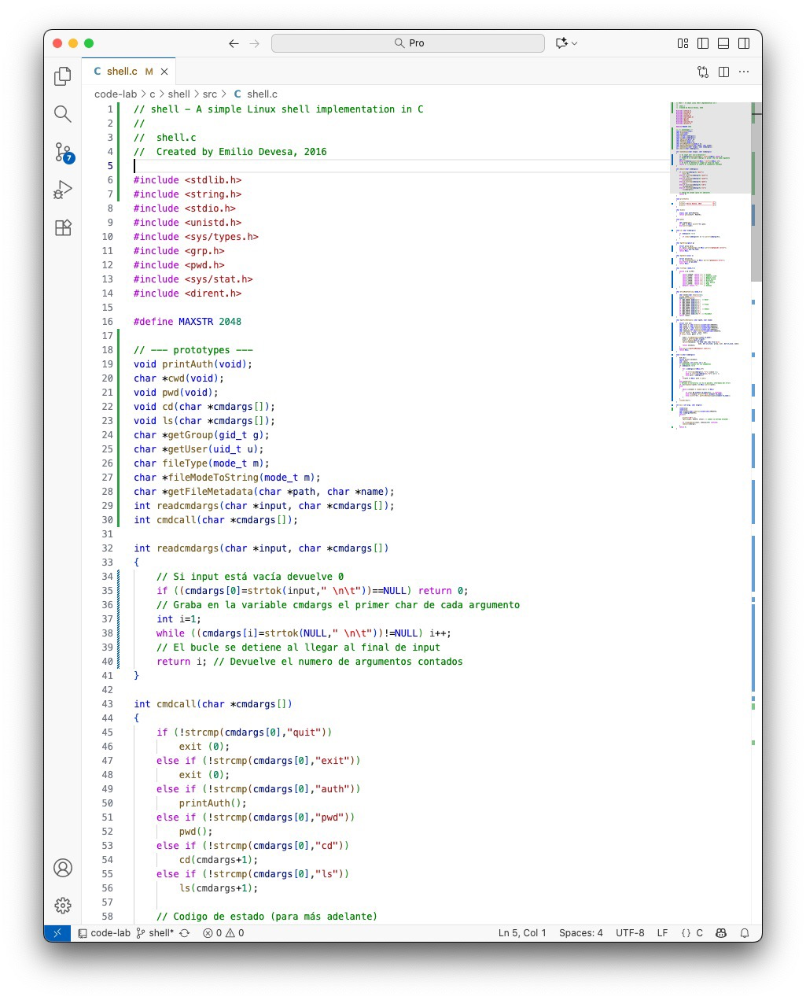