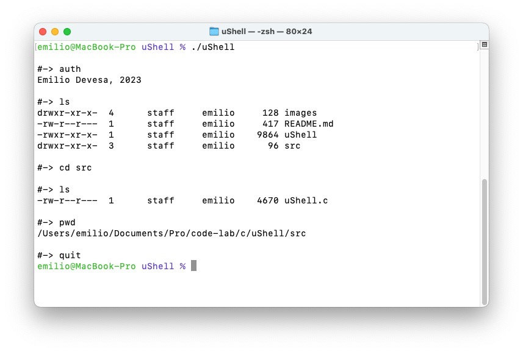
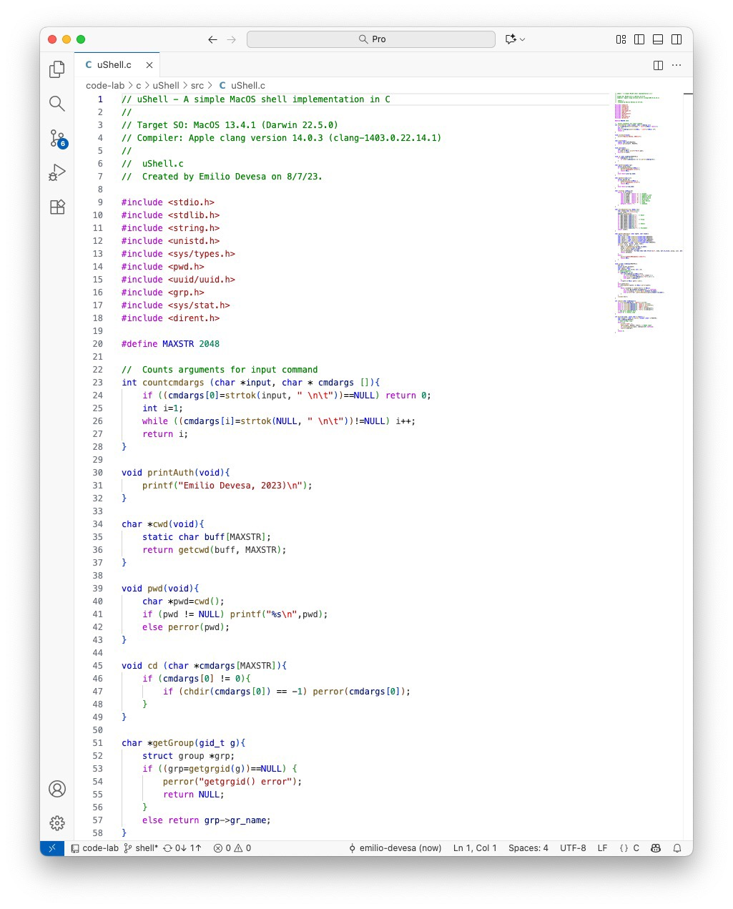

## uShell

uShell is a small terminal that allows you to navigate through your directory structure and list the files in your file system: 



Compilation:
```
$ clang uShell.c -o uShell
```
Run:
```
$ ./uShell
```



uShell is the implementation of my other project “shell,” modified to work properly on macOS.