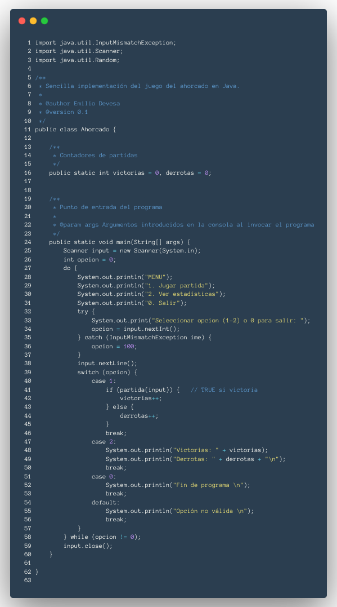
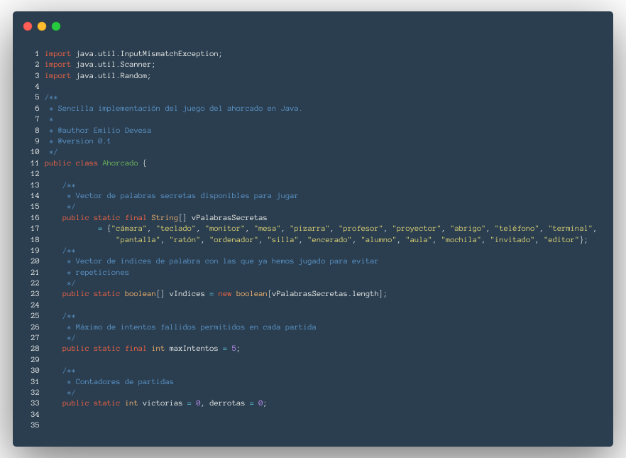
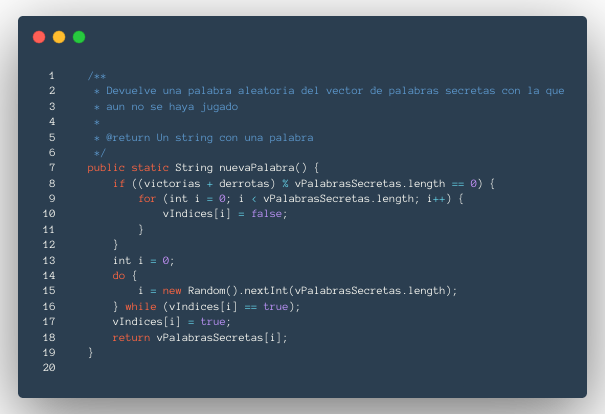
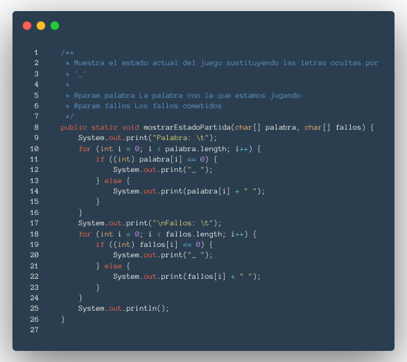
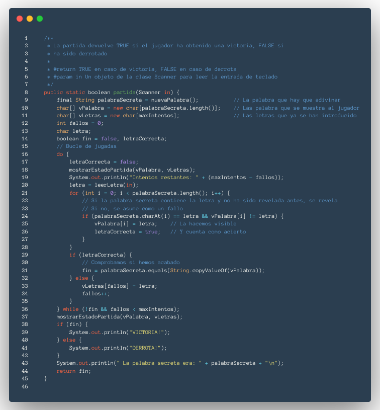
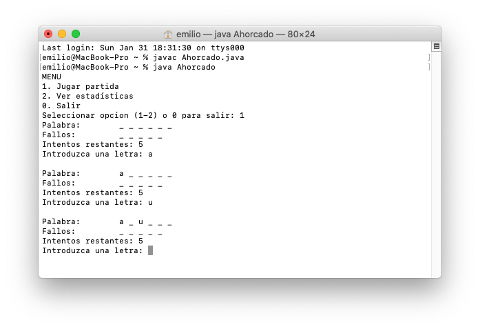
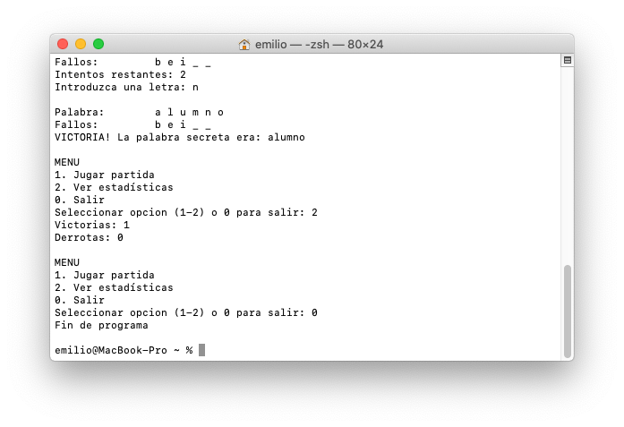

## Ahorcado

Implementación en Java del juego del ahorcado:

_Queremos desarrollar un programa que ejecute el juego del ahorcado. En cada partida presenta la palabra secreta escrita con "\_" y se van revelando las letras que el usuario acierta. Se permite cometer hasta 5 fallos como máximo. Las letras que no formen parte de la palabra secreta cuentan como fallos; y si se introduce una letra correcta que ya había sido revelada con anterioridad, también. La partida solo termina si el usuario acierta la palabra o si se han cometido el número máximo de fallos._ 

Además, he introducido tres elementos extra:  
- Un menú con tres opciones: jugar partida, ver estadísticas y salir. El programa se ejecuta hasta que el usuario selecciona la última opción. 
- Las estadísticas de partidas ganadas y partidas perdidas. 
- El programa cuenta con un conjunto de palabras para jugar. Se escogerán de forma aleatoria pero tratando de evitar que se produzcan repeticiones en la medida de lo posible.

**El programa principal**  
Vamos a empezar creando la clase _Ahorcado_ y dos variables que serán el numero de victorias y el de derrotas. En el método _main()_ es donde creo el bucle que muestra el menú, lee la opción que introduce el usuario y la ejecuta. Para leer texto por teclado estoy empleando la clase _Scanner_, que pertenece al paquete _java.util_ y que he importado al principio. Es muy cómodo hacerlo de esta manera porque me devuelve el primer número entero que el usuario teclea. Hay la posibilidad de que el usuario introduzca algo que no sea un número, por lo que debo encerrar la lectura de la variable opción entre _try-catch_. No es mi forma favorita de manejar excepciones pero es un caso muy sencillo y se puede hacer aquí directamente. La excepción que debemos controlar es que los tipos no coincidan, o lo que es lo mismo, _InputMismatchException_, que también pertenece al paquete _java.util_ y debo importar al principio. Si el _try-catch_ no detecta ninguna excepción, se lee el número que introduce el usuario. Si la detecta pone un número cualquiera, en mi caso el 100. Es importante que una vez leída la opción (o controlada la excepción), vaciemos el resto del buffer de entrada, simplemente leyendo hasta el final de línea con el método _input.nextLine();_. 

 

En la sentencia _switch(opcion)_ es donde esa opción se transforma en realidad. Si el usuario ha introducido el número 1, arrancará el método _partida()_. Debo pasarle el objeto input de la clase _Scanner_ para poder leer las letras que vaya introduciendo, y esperaré a que el método retorne _FALSE_ si el usuario ha perdido o _TRUE_ si ha adivinado la palabra. Dependiendo de ese valor, aumento un contador u otro. La opción 2 simplemente muestra el valor de éstos y la 0 anuncia el final del programa. La opción _default_ informa de que la opción introducida no es válida. Se llega a este punto tanto si el usuario mete un número incorrecto (p. ej el 5) o cualquier carácter que provoque la excepción que controlaba el _try-catch_, ya que la variable opción valdría 100. Por último, cuando el programa termina, invocamos _input.close()_ para cerrar el buffer de entrada.

**Las palabras**  
Durante las partidas vamos a necesitar unas cuantas palabras con las que jugar. Yo he decidido almacenar unas cuantas en un array de Strings al que llamo _vPalabrasSecretas_. La variable _maxIntentos_, marcada como final para evitar que se cambie accidentalmente durante el juego, establece el numero máximo de intentos fallidos que tiene un jugador para adivinar la palabra secreta. Si se quiere hacer más fácil el juego, se aumenta este número y listo, no es preciso ningún otro cambio.

 

También tengo otro array de índices para controlar la repetición de las palabras. La idea es muy sencilla: el tamaño de _vIndices_ es el mismo que el de Strings; si ya he jugado con una palabra, el valor del índice correlativo lo marco como _TRUE_. Si un índice tiene valor _FALSE_ entonces es que la palabra correlativa en _vPalabrasSecretas_ aun no ha sido seleccionada para jugar. Por ejemplo: Si juego con la palabra _vPalabrasSecretas\[0\]_ ("cámara"), pongo _TRUE_ en _vIndices\[0\]_. Si después, juego con la palabra "terminal" (que está en la posición 9), pongo _vIndices\[9\]_ a _TRUE_. ¿Podría esto resolverse con un único array bidimensional? Sí, perfectamente; pero lo he hecho así para no enrevesarlo mucho. Si se quiere apostar por esa solución, no se requieren grandes cambios.

Con esto definido, voy a crear un método que devuelva una palabra secreta nueva y si es posible con la que no se haya jugado hasta el momento. La forma de hacerlo es calcular el módulo de partidas ya jugadas entre el número de palabras disponibles para jugar. Cuando el juego empieza (_0 % vPalabrasSecretas.length = 0_) o cuando ya se ha jugado con todas, pondremos todos los valores de _vPalabrasJugadas_ a _FALSE_. Después, se pide un numero entero aleatorio (_Random().nextInt()_) que va de 0 hasta el número de palabras que hay en el vector. Esto se repite todas las veces que sea necesario mientras el índice correspondiente sea _TRUE_ (es decir, mientras las palabras en ese índice ya hayan salido) hasta que encuentre un índice que vale _FALSE_ (una palabra con la que aún no se ha jugado). Cuando hemos encontrado ese índice, se sale del bucle. Lo marcamos como _TRUE_ y devolvemos la palabra en esa posición. 

 

La clase _Random_ debe ser importada, también forma parte del paquete _java.util_.

**Otras operaciones**  
Dentro del método _partida_ hay dos secuencias de instrucciones que, sin ser complejas, nos conviene programar en métodos aparte. Así facilitamos la limpieza y la comprensión del código del método _partida()_ cuando lleguemos a él. La primera operación, por obvia, es _leerLetra()_. Debe recibir el input en los parámetros parámetros de la llamada y devolver un único carácter. Por supuesto, controlaremos las excepciones correspondientes, tal y como hicimos al leer las opciones del menú principal.

 

Como la clase _Scanner_ no proporciona un método para leer el primer carácter, lo que hacemos es leer toda una línea (_nextLine()_), convertirla a minúsculas (_toLowerCase()_), y de ahí tomamos el carácter en la posición 0 (_charAt()_); En la clase _Character_ tenemos un método llamado _isLetter()_ que comprueba si un carácter dado es una letra, y no terminaremos el bucle de pedir letras mientras no obtengamos una.

El siguiente método que he escrito es el que _mostrarEstadoPartida()_. Básicamente lo que hace es escribir en pantalla tantos "_\__" como caracteres componen la palabra secreta, o la letra si ésta ya ha sido revelada por el jugador. A continuación, escribe las letras que no forman parte de la palabra o las que ya se revelaron previamente, porque contarán como fallos, y tantos "_\__" como intentos restantes de los que disponga. Tanto la palabra como las letras son arrays de char, lo que nos evita tener que andar construyendo nuevas cadenas a partir de subcadenas en cada sustitución. 

**La partida**  
Y finalmente, vamos al método _partida()_, que es el que desarrolla el juego. Para empezar, debo recordar que devuelve _TRUE_ si el usuario gana la partida y _FALSE_ si pierde. Podría hacerlo también como _int_ porque hay juegos donde existe la posibilidad de empate, o por si quiero programar que el jugador pueda abandonar una partida sin que se contabilice como victoria o derrota. El método debe recibir el argumento _Scanner_ desde _main()_, para poder pasárselo a su vez al método _leerLetra()_.

 

He estructurado el método en cuatro bloques que son:  
1. Preparación de las variables: Solicito la palabra secreta al método _nuevaPalabra()_, creo un array de char _palabra\[\]_ con la misma longitud para almacenar la letras que el jugador acierta y otro con el tamaño _maxIntentos_ para las letras falladas _vLetras\[\]_.
2. Muestro el estado de la partida y los intentos restantes, y leo una letra. Si esa letra forma parte de _palabraSecreta_ y no de _palabra\[\]_ entonces la revelo.
3. Siempre que se haya acertado una letra, se compara _palabraSecreta_ con _palabra\[\]_ (podemos convertir el contenido del array a String con el método _String.copyValueOf()_). Si son iguales, la palabra ha sido revelada y ponemos fin a _TRUE_. Si no se ha acertado la letra, la apuntamos en _vLetras_ y aumentamos el contador de fallos.
4. El último bloque verifica si la partida ha terminado porque la variable fin era _TRUE_, lo que significaría una victoria. Si hemos llegado hasta ahí y todavía vale _FALSE_, es una derrota. Mostramos los mensajes adecuados y devolvemos el valor de fin.

**Compilación y ejecución**  
 

