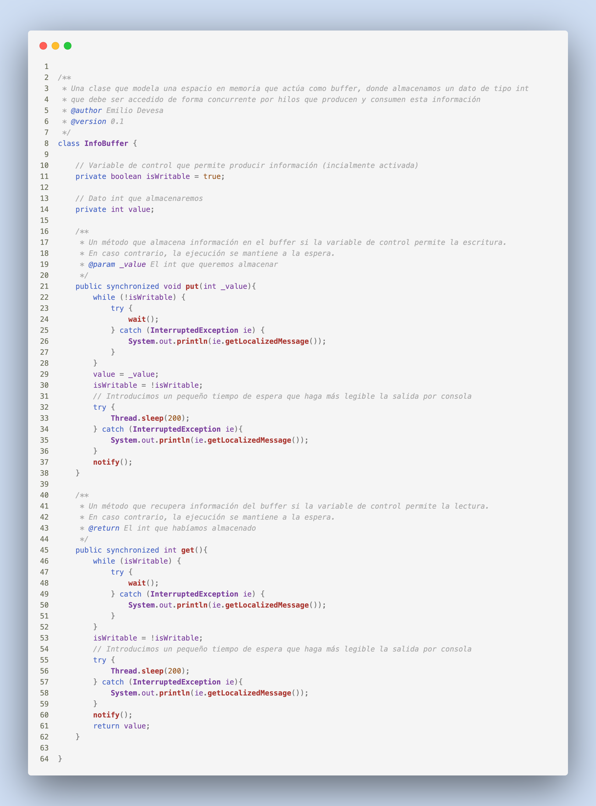
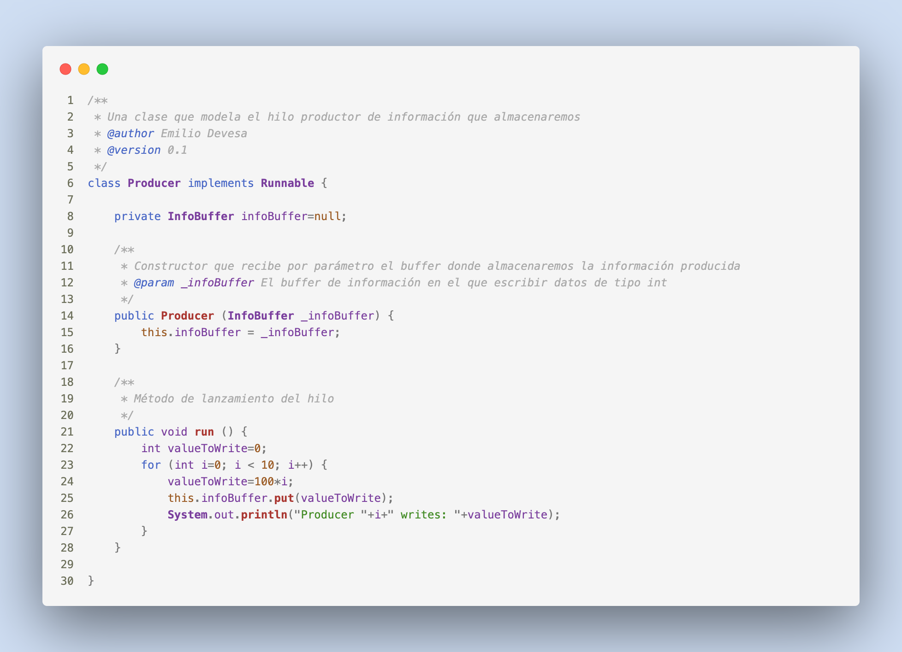
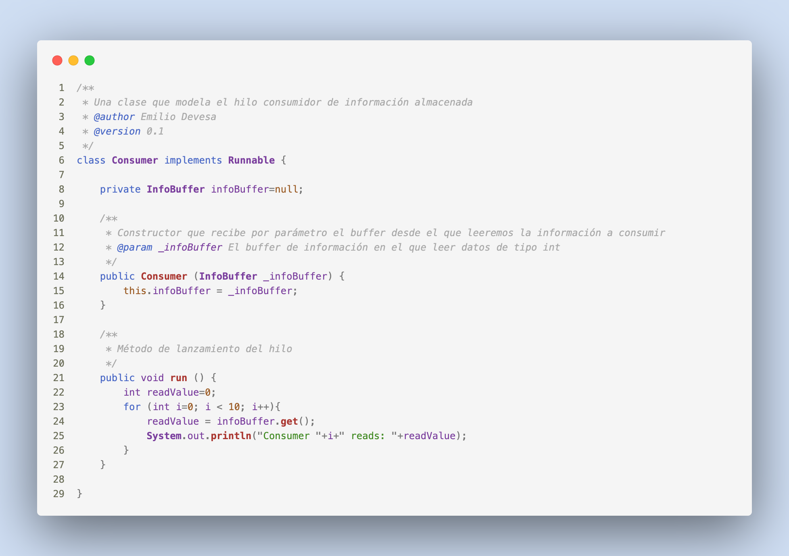
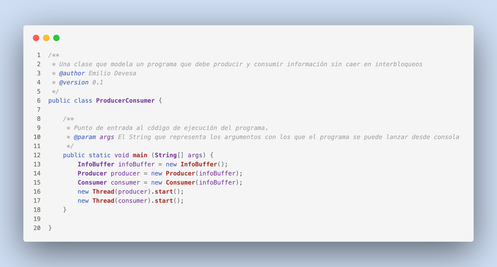
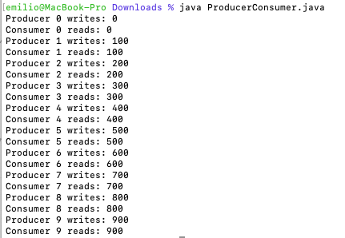
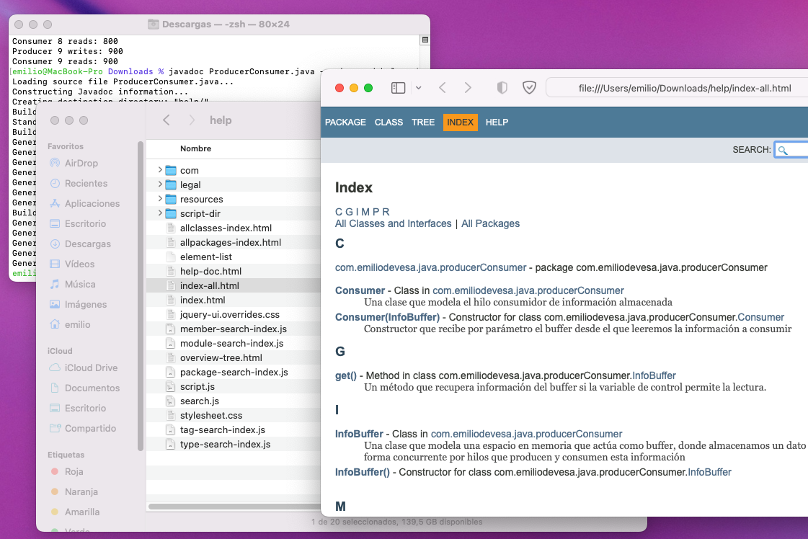

## Problema Productor-Consumidor

He desarrollado un pequeño código a través del cual poder entender y experimentar con el escenario conocido como "problema de productor-consumidor", que tiene que ver con sincronización de hilos y acceso a memoria.

Para ponernos en contexto, pensemos en un programa que lanza dos procesos (o más) que deben escribir y consultar el contenido de una variable de forma repetitiva. El proceso que genera los datos (el productor) no puede seguir escribiendo nuevos datos mientras la variable aun contenga el dato anterior; y el proceso que los consulta (el consumidor) no debe obtenerlos mientras no hayan sido actualizados (o mientras no hayan empezado a generarse). La variable puede ser cualquier cosa, no necesariamente una tipo de dato simple. Podemos estar hablando incluso de estructuras abstractas de datos: listas, pilas, etc.

La forma de resolver todo esto se basa en un mecanismo sencillo, aunque no trivial. Veámoslo por partes.

**Los datos**  
Para este ejemplo voy a desarrollar una clase llamada _InfoBuffer_, que simplemente contendrá un valor entero. Este valor será privado y solo se puede consultar a través de los métodos _put_ y _get_. Una variable llamada "_isWritable_" actúa como bandera (flag) para señalar si la variable está esperando para ser escrita o para ser leída. Inicialmente la ponemos como verdadera, para que el primero en actuar sea el productor. 



Lo realmente importante está en el hecho de que los métodos _get_ y _put_ son métodos sincronizados ("_synchronized_"). Marcarlos como tal hace que mientras uno se ejecuta en un hilo, el resto de métodos quedan bloqueados para esa instancia de esa clase (se mantiene su ejecución en espera). Es decir, si yo tengo un objeto de tipo _InfoBuffer_ y estoy leyendo (_get_) en un hilo, otros hilos deben esperar si están intentando realizar operaciones que estén también marcadas como "_synchronized_". Esto previene que los métodos intenten acceder de forma concurrente a la misma variable, y que cada uno espere a que el anterior termine.

En el caso del método _put_, comprobamos si la variable está en modo escritura. Si no lo está, hacemos que el hilo espere. Cuando esté, salimos del bucle _while_, cambiamos el valor y la ponemos en modo de lectura (_!isWritable_). El método _get_ realiza las mismas operaciones pero con la comparación opuesta y retorna el valor almacenado.

**El productor**  
La clase productor debe implementar la interfaz _Runnable_ para poder lanzarla más adelante en un hilo separado. Algo similar podría obtenerse haciendo que extienda la clase _Thread_, pero yo he preferido hacerlo así. Para construir un productor, debemos pasarle el objeto _InfoBuffer_ sobre el que estará escribiendo. El método _run_ contiene un bucle con 10 pasos en los que tratará de almacenar un valor en el objeto _InfoBuffer_.



**El consumidor**  
La clase que consume datos funciona de forma análoga al productor. En este caso el bucle ejecuta 10 veces la función _get_ para mostrar los datos en pantalla.



**Programa principal**  
El programa principal solo tiene que crear un objeto _InfoBuffer_, un productor y un consumidor, dándoles la referencia del primero. Ambos procesos se lanzan en hilos separados.



**Output**  
El programa se puede compilar mediante la orden de terminal: 
```
$ javac ProducerConsumer.java
``` 
Se ejecuta con: 
```
$ java ProducerConsumer
``` 
O directamente, sin compilar ni nada, se puede hacer: 
```
$ java ProducerConsumer.java
```
(Esto sólo funciona si todas las clases están escritas en el mismo archivo pero la primera es la clase pública que contiene el método "_main_").

La salida es:

 

Y se puede ver cómo el programa va escribiendo diferentes valores en cada paso del bucle de escritura, alternándose con las operaciones de lectura de esos valores de forma ordenada a pesar de haber sido lanzadas desde dos hilos concurrentes.

**Documentación**  
Puedes generar documentación del programa "parseando" los comentarios escritos en el código si ejecutas la orden: 
```
$ javadoc ProducerConsumer.java -package -d help
``` 
Esto generará un directorio llamado "_help_" con unos cuantos archivos dentro. Si abres el archivo "_index-all.html_" en tu navegador, verás algo como esto: 


