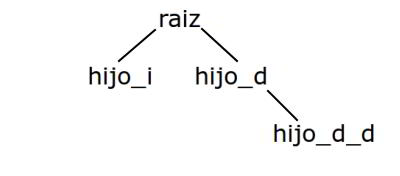
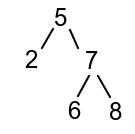

# Ocaml

Ocaml es un lenguaje de programación funcional con cuatro características básicas:  
- Está fuertemente "tipado".
- El "tipaje" es estático.
- Las expresiones se evalúan de forma "eager" (estricta o completa, es decir, se evalúan todas las entradas/salidas posibles)
- No hay variables como las variables en la programación imperativa.

Ocaml dispone de un compilador por lotes (un compilador tradicional, como "gpc" para programas en Pascal, o "gcc" para programas en C). Se invoca desde la línea de comandos con la instrucción:
```
$ ocamlc archivo.ml
```

donde `archivo.ml` es el archivo con el código fuente en lenguaje Ocaml. Sin embargo resulta mucho más práctico el compilador interactivo, invocado con:
```
$ ocaml
```

En el compilador interactivo, las instrucciones se van compilando y ejecutando según las vamos introduciendo, y son válidas hasta la finalización del programa. El compilador interactivo es un prompt simbolizado por el sigo almohadilla, y cada vez que escribamos una instrucción, la finalizaremos con doble punto y coma (sino, aunque pulsemos enter, el compilador estará esperando a que tecleemos el fin de instrucción). Veremos algo como esto:
```
# sentencia;;
```

El primer ejemplo que podemos ver es una expresión matemática. Si introducimos esta instrucción:
```
# 2 + 5;;
```

El compilador la compilará y ejecutará de forma automática. Además nos mostrará generosamente una información adiccional por pantalla:
```
- : int = 7
```

En esta línea, el guión simboliza la línea que hemos introducido nosotros. Calcula el valor de la expresión e infiere su tipo. Se trata de un entero ("int", como "integer" en Pascal) y el valor es 7. Las expresiones son objetos de primer orden en Ocaml.

En Ocaml se pueden introducir comentarios (utiles en el codigo fuente de los archivos .ml). Han de ir escritos entre (* y *). El compilador interactivo se cierra escribiendo la instrucción:
```
# #quit;;
```

## Comentarios
```
# (* Esto es un ejemplo de comentario. La segunda almohadilla de esta línea indica que estamos escribiendo una instrucción para el compilador, no una expresión para compilar y evaluar *)
```

## Tipos de datos y algunas operaciones

Tipos básicos:
- int: enteros, comprendidos entre min_int y max_int.
- float: reales en coma flotante.
- bool: valores lógicos { true / false }
- char: caracteres del código ASCII. Por ejemplo: 'a' (comillas simples).
- string: cadenas de chars. Por ejemplo: "a" (comillas dobles). La cadena más simple es la vacía: "".

**Algunos operadores habituales:**

Para int: + - * /

Para float: +. -. *. /.     (* igual que en los int, pero seguidos de un punto. En Ocaml no se sobrecargan los nombres, por eso no se llama de igual forma la suma de enteros que la de reales *)

Para bool: && (conjunción) || (disyunción)

Para string: ^ (concatenación)

**¿Más tipos en Ocaml?**

Hay infinitos, y son inferidos por el motor de tipos del lenguaje. Por ejemplo, la expresión:
```
# 2,5;;
- : int*int = (2,5)
```

Se entiende como el producto cartesiano (un par, un vector) de dos números: 2 y 5. Su tipo es de int*int (el producto cartesiano de dos int). Este tipo no está definido a priori, pero el lenguaje reconoce dos enteros separados por la coma.
También existe, por lo tanto el tipo int*char o el tipo string*int. Por ejemplo, prueba a teclear lo siguiente para comprobarlo:
```
# 3,'a';;
# "hola",10;;
```

Por eso hay infinitos. Y además de pares se pueden construir tríadas, cuádruplas, etc.
```
# 2,4,10;;
# "hola","adios",'!';;
```
Además existen tipos desconocidos o que no se pueden inferir con total certeza. Por ejemplo cuando la entrada o la salida de una expresión puede corresponder a diferentes tipos. En este caso, hablaremos de tipos alfa, beta, etc. Dado que el compilador no puede mostrar letras griegas en pantalla, se referirá a ellas con la letra correspondiente precedida de un apóstrofe: 'a, 'b, 'c, etc. etc.

## Definiciones (let)

Las definiciones en ocaml asocian un nombre a un valor o a una expresion. Tienen la siguiente forma:
```
# let <nombre> = <expresión>;;
```
donde:
- <nombre> es el nombre que queremos emplear en adelante para...
- <expresión> la expresión o valor a la que nos pretendamos referir en adelante.

Por ejemplo:
```
# let p = 2, 5;;
val p: int * int = (2, 5)
```
por lo tanto siempre que empleemos una p en el programa despues de esta línea, se referirá al par (int * int) con valor (2, 5). Tambien es interesante entender que:
```
# let diez = 5 + 5;;
val diez = 10;;
```
se refiere al valor entero 10, no a la operación 5 + 5, pues su resultado queda ya evaluado.

### Definiciones de varios valores
```
# let x, y = 5, 3;;
val x : int = 5
val y : int = 3
```
No hay mayor explicación. Separando varios nombres con comas, y sus correspondientes expresiones o valores con comas, podemos dar varios valores a varios nombres de forma más rápida. En general, podemos decir entonces que:
```
# let <patrón> = <expresión>;;
```
pues no solo sirve para un único nombre y valor. De todas formas, es interesante revisar el capítulo de definiciones múltiples, con las que estas guardan gran parecido pero albergan tambien grandes diferencias.

### Pattern Matching
El pattern matching es el nombre con el que nos referimos a la comparación entre el patrón y la expresión para ver si esta se amolda a aquel. De no hacerlo, obtendremos un error de pattern matching. Por ejemplo:
```
# let x, y = "hola";;
```
esto conduce a un error, porque se está intentando asignar un string a una variable x pero nada a la variable y. El error devuelto es:
```
Error: This expression has type string but is here used with type 'a * 'b
```

**Definiciones locales:**

Se realizan con la palabra reservada "in". Por ejemplo:
```
# let p = 1 in 2 + p;;
val p : int = 3
```
en este caso, p solo valdrá 1 dentro de esta expresión.

**Restricciones sobre los nombres:**

Los nombres solo pueden empezar por letra minúscula y no pueden contener espacios o caracteres especiales. En su lugar se pueden emplear guiones bajos. Tampoco se puede emplear la "ñ", ni caracteres de alfabetos que no sean el inglés. A modo de ejemplo, unos nombres válidos pueden ser:
```
numero
frase_ingeniosa
mi_funcion
ejemplo_con_Mayusculas
```
Algunos nombres no válidos pueden ser:
```
Cosa
Cosa que no sirve
Ñandú
Est@_N0_5irV€
```

## Funciones (function)

Las funciones en matemáticas son expresiones que asignan una imagen a cada punto de su dominio.
```
F (x) = a
```
En Ocaml, podemos trabajar con funciones de forma muy similar:
```
# function <patrón> -> <expresión>;;
```
Por ejemplo:
```
# function x -> 0;;
- : 'a -> int = <fun>
```
Es decir, la funcion lleva cualquier x (de cualquier tipo) al entero 0;;

### Definiciones con funciones

Lo mejor de todo es que podemos combinar las definiciones (let) con las funciones (function). Imaginemos la funcion "multiplicar por dos". En ella, cada punto del dominio tiene una imagen obtenida tras hacer el producto de ese punto y dos.
```
Multiplicar por dos (x) = x * 2
```
En Ocaml podemos escribir la funcion simplemente:
```
# function x -> x * 2;;
- : int -> int = <fun>
```
Si la empleamos con let le podemos dar un nombre, por ejemplo "doble":
```
# let doble = function x -> x * 2;;
val doble : int -> int = <fun>
```
Como vemos, tan solo se trata de sustituir la expresion de una definición por la forma de una función. Pero incluso podemos escribir esto mismo de una forma abreviada y más natural todavía:
```
# let doble x = x * 2;;
```
Es exactamente lo mismo, pero incluso a la hora de leerlo resulta más cómodo.

### Funciones en forma "Curry"

Pensemos por un momento en esta definición de una función:
```
# let suma (x, y) = x + y;;
val suma : int * int -> int = <fun>
```
Se suma el par de números x e y. Alternativamente podemos pensar en una función de x llevada en una función de y. Esto es:
```
# let suma = function x -> (function y -> x + y)
```
O si la abreviamos dos veces:
```
# let suma x = function y -> x + y;;
# let suma x y = x + y;;
```
Se parecen mucho a la primera, pero su tipo ahora es:
```
# let suma x y = x + y;;
val suma : int -> int -> int = <fun>
```
Esta es la forma curry de ver una operación binaria como la suma: una función anidada dentro de otra. La ventaja es que mientras la primera definición que dimos requería un par de enteros, la forma "Curry" puede aplicarse a solo uno:
```
# suma 1;;
- : int -> int = <fun>
```
O utilizarla de más formas, como por ejemplo:
```
# let suma_uno = suma 1;;
val suma_uno : int -> int = <fun>
# suma_uno 3;;
- : int = 4
```

### Definiciones múltiples (and)

En el apartado "Definiciones (let)" vimos como definir varios valores en una única instrucción, separándolos mediante comas:
```
# let suma x, y = 5, 3;;
val x : int = 5
val y : int = 3
```
Ocaml no nos permitirá hacer esto con funciones ya que se produce un error de sintaxis:
```
# let doble x, triple x = x * 2, x * 3;;
Error: Syntax error
```
Para hacerlo tenemos que recurrir a la palabra reservada and. Ojo! Recuerda que el AND de una expresion booleana se escribe con doble ampersand "&&". Una definición múltiple en ocaml podemos escribirla así:
```
# let doble x = x * 2 and triple x = x * 3;;
val doble : int -> int = <fun>
val triple : int -> int = <fun>
```
Debemos tener en cuenta varios detalles. En primer lugar, no podemos repetir el nombre de ninguna funcion, es decir no podríamos escribir:
```
# let doble x = x * 2 and triple x = x * 3 and doble y = y *2;;
```
Además se desconoce el orden en el que se evalúan las expresiones. Visto en un ejemplo:
```
# let x = 2;;
val x : int = 2
```
Si ahora hacemos:
```
# let x = x + 1 and y = 2 * x;;
```
El resultado es:
```
val x : int = 3
val y : int = 4
```
Y no a 3 y 6 respectivamente como cabría esperar. A efectos prácticos podemos pensar que se toma el valor de x anterior a la definición múltiple.

De forma más esquematizada podemos generalizar la forma de las expresiones múltiples tal como:
```
# let <patrón_1> = <expresión_1>
and <patrón_2> = <expresión_2>
...
and <patrón_n> = <expresión_n>;;
```

## Condiciones (if) y reglas (|)

### Condiciones (if)

Vamos a definir una funcion absoluto: int -> int. Esta funcion recibirá un numero entero y devolvera su valor absoluto. Obviamente necesitamos evaluar si se trata de un numero negativo o si es un numero positivo. Las condiciones en Ocaml se programan con la sentencia:
```
if <condicion> then <expresion true> else <expresion 2>
```
La funcion del valor absoluto puede resolverse de la siguiente forma:
```
# let absoluto x =
        if x < 0
        then -x
        else x;;
```
Si x es un numero negativo (x < 0) entonces le cambiamos su signo (-x). Si no es un numero negativo significa que ya es positivo o es cero, y en ese caso no hay que hacer nada. Se devuelve x tal y como entró.

### Reglas (|)

Las reglas es otra forma de establecer varios caminos alternativos en Ocaml, con la ventaja de que podemos establecer tantas posibilidades como necesitemos, lo que les da una enorme flexibilidad. Imaginemos que necesitamos una funcion cambia_signo : int -> int que nos cambie el signo de un numero dado (x) salvo en el caso del cero, cuyo resultado es cero tambien. En una version condicional tendríamos:
```
# let cambia_signo x = if x = 0 then 0 else -x;;
```
Pero podemos programarla con reglas. La forma sería:
```
# let cambia_signo = function
            0 -> 0
            | x -> -x;;  
```
¿Como funciona esto? Es muy sencillo. El valor de entrada de la funcion es x. El pattern matching evalúa con qué patrón de los dos que hemos escrito se corresponde x (que sea cero o que no lo sea) y en cada caso establece una expresion. Según con qué patrón coincida x, el resultado de la funcion será la expresion correspondiente.

El orden es muy importante, por lo que debemos establecer los casos más particulares al principio y los más generales al final. Con el uso de listas veremos porqué.

## Recursividad y recursividad terminal (rec)

### Recursividad (rec)

Veamos el problema de resolver el factorial de un numero n. En matemáticas:
```
n! = n * (n-1)!
```
El factorial de un numero n es n multiplicado por el factorial del numero anterior. El factorial de 0 es 0 y el de 1 es 1. Es por naturaleza una función recursiva: se llama a sí misma para resolverse.
```
3! = 3 * 2! (aquí se produce una llamada para resolver !2)
        2! = 2 * 1! (aquí se produce una llamada para resolver !1)
                1! = 1 (éste es un resultado proporcionado por el caso base)
        2! = 2 * 1 = 2 (ahora se empieza a resolver volviendo a las llamadas superiores)
3! = 3 * 2 = 6 (ya se ha resuelto el problema. Finalmente el factorial de 3 es 6).
```
En Ocaml la recursividad es una de las herramientas más potentes disponibles. Veamos como implementar la funcion factorial : int -> int para un numero positivo n:
```
# let rec factorial n =
                if n <= 1
                then n
                else n * (factorial (n -1));;
```
Como vemos, resulta todo autoexplicativo: la única diferencia para poder invocar la funcion que se está definiendo dentro de la propia definición es la palabra reservada "rec" entre el let y el nombre de la función.

### Recursividad terminal (rec)

Dado que las llamadas a cada proceso recursivo quedan pendientes de resolver, se almacenan en la pila de la memoria hasta que sea posible calcularlas. Esto llena la memoria disponible enseguida pero podemos evitarlo utilizando recursividad terminal, una forma de programar funciones recursivas pero sin dejar cuentas pendientes. Viendo el caso anterior del factorial, podemos pensar en la siguiente funcion que contiene una funcion auxiliar. Ésta última es en realidad la implementada de forma recursiva:
```
# let factorial x = let rec f_auxiliar (n, resul) =
                if n = x
                then resul
                else f_auxiliar (n+1, resul*(n+1))
  in f_auxiliar (1,1);;
```
Esto funciona de la siguiente forma:
- n y resul comienzan en el valor 1 y 1 respectivamente
- mientras n no sea igual a x, se realiza una llamada recursiva en el que n y resul aumentan de valor. n pasa a ser 2 y resul es el resultado de multiplicar resul por 2.
- cuando n sea igual a x, resul será la multiplicacion de todos sus números anteriores.

Esta solucion que puede parecer trivial es muy eficiente. En lugar de almacenar operaciones de forma acumulativa, va modificando un entero dado (resul). Generalmente para resolver un problema recursivo necesitaremos un valor que iremos modificando conforme la recursividad terminal avance.

**La sucesión de Fibonacci**

La sucesion de Fibonacci es aquella que asocia el 0 al 0, el 1 al 1, y a cada numero entero siguiente, la suma de los dos anteriores:  
```
Fib(0) = 0
Fib(1) = 1
Fib(2) = 1 porque (1 + 0) 
Fib(3) = 2 porque (1 + 1) 
Fib(4) = 3 porque (2 + 1) 
Fib(5) = 5 porque (3 + 2) 
Fib(6) = 8 porque (5 + 3) 
etc.
```
La solución más natural pudiera ser:
```
let rec fibonacci n = if n < 2
		then n
		else fibonacci (n-1) + fibonacci (n-2);;
```

Aunque pueda parecer algo muy sencillo, la complejidad es enorme. Tanta, que calcular el fibonacci de 30 puede llevarle varios segundos a una máquina actual; cuando hacerlo con papel y lapiz es cuestion de un minuto o menos. El problema radica en la doble llamada recursiva del else. Para calcular el fibonacci de 30, hay que tener calculado el fibonacci de 29 y el de 28. Para el de 29 necesitamos el de 28 y el de 27, mientras que para el de 28 necesitamos el de 27 y el de 26. Y así sucesivamente, las operaciones se van ramificando y no resulta tan sencillo. 

Quizás en el momento de leer esto, las máquinas sean más potentes, pero para numeros menores de 50 la cosa se complica sorprendentemente. Calcular el fibonacci de 38 le ha llevado a mi cpu más de 16 segundos. Como dato anecdótico calculado por el profesor: calcular el fibonacci de 100 podría llevarle varios millones de años. Literalmente.

Para resolver esto de forma recursiva terminal, aplicaré otra estrategia: dado que hay muchas operaciones repetitivas, procuraremos no tener que hacerlas. Al igual que en el factorial siempre llevábamos el resultado anotado, aquí llevaremos los resultados (dos, concretamente) que precisemos. Consideremos i el numero cuyo fibonacci queremos calcular, a el fibonacci de su anterior y aa el fibonacci del predecesor de éste: 
```
Fib(i) = a + aa 
```
Si conseguimos llevar a y aa calculados en cada iteracion, solo habrá que devolver su suma. Una primera aproximación podría ser:
```
let fibonacci n = if n < 2
		then n
		else let rec fibonacci (i, a, aa) = if i = n
				then a + aa
				else fibonacci (i+1, a+aa, a)
		in fibonacci (2, 1, 0);;
```

**¿Como funciona esto?**  

De nuevo, la función principal deja de ser recursiva y controla los casos base (0 y 1) con el condicional if. En el else, los resultados se calculan con una función recursiva interna. El secreto está en que no se calcula el fibonacci como tal, sino que se hacen las sumas de los numeros tal y como lo haría una persona con papel y lápiz. Comenzando en el 2, su fibonacci será la suma de 0 y 1. Por lo tanto (ver else) el fibonacci de 3 se calculará en una llamada recursiva cuyos parámetros son:
```
fibonacci (i+1, a+aa, a)
```
En la iteración del 2, tal y como se define en el let in:
```
fibonacci (2, 1, 0)
```
En la iteración del 3...
```
fibonacci (2+1, 1+0, 1)
```
o lo que es lo mismo:
```
fibonacci (3, 1, 1)
```
que al sumar a y aa...
```
a+aa = 1+1 = 2
```
y 2 es precisamente el fibonacci de 3. De nuevo, lápiz y papel serán grandes aliados. Es tal la mejora que se produce, que ahora podemos calcular números altísimos casi de forma instantánea. De hecho, nos saldremos del rango de numeros enteros antes de apreciar el tiempo que el ordenador emplea en terminar los cálculos, concretamente en el numero 45.

**Una última reflexión...**  
En el libro 'Introducción a la programación con Java: Un enfoque orientado a objetos', de David Arnow y Gerald Weiss; se encuentra una de las mejores definiciones de recursividad que he visto:

> Programar algo recursivo requiere pensarlo desde una postura vaga.

Por ejemplo, si tengo que fregar toda una pila de platos, puedo fregar uno y mandarle el resto a otra persona o decir que terminé si no quedan platos en la pila. El que venga detrás de mí actuará igual que yo y al final, los platos quedarán lavados. 

Es la misma idea del factorial. Yo no se cuanto vale el factorial de 3, pero sé que es el resultado de multiplicar 3 por el factorial de 2, etc. 

Sin embargo, tras haber escrito esto también llego a la conclusión de que para programar algo de forma recursiva terminal, primero hay que razonar el problema con lápiz y papel. Si es más simple hacerlo con lápiz y papel (ya sean cuentas o diagramas de flujo de un programa), como en el caso de la recursividad de la sucesión de Fibonacci, lo más probable es que tenga que simular ese efecto en el ordenador: el efecto de poder guardar en una variable operaciones ya calculadas para no tener que repetirlas. Sean una o varias. 

En concreto en Ocaml, por las particularidades de su sintaxis, vale la pena seguir esos dos pasos: desglosar una función recursiva en una función anidada en otra. En la primera podemos controlar directamente los casos base y dejar el carácter recursivo para una función interna, protegida de cara al usuario y en la que podemos permitirnos usar más parámetros según nuestras necesidades. 

Por otro lado, podríamos recurrir a la librería "Num" para poder tratar con resultados numéricos enteros tan grandes.

**Millones de años**

Algo tan simple como pudiese ser calcular el Fibonacci de 100 con papel y lapiz (cuestión de unos pocos minutos) se transformaría en millones de años si empleasemos un ordenador de potencia media y la definición recursiva de Fibonacci. Usemos algo de aritmética para calcular el tiempo que necesitarías.

Supongamos que mi pc puede calcular fib(35) en unos escasos 4 segundos. La complejidad de los cálculos de la sucesión de Fibonacci es de:
```
k = (1 + (sqrt 5)) / 2
```
Podemos trasladar esto a ocaml:
```
let k = (1. +. sqrt 5.) /. 2.;;
```
lo que (al resolver) produce un número irracional tradicionalmente conocido como el número áureo: 1.61803398874... 

Si quisieramos calcular el Fibonacci de 45, estaríamos calculando 10 números más allá del fib(35) del que hablamos hace un par de líneas. Éste tardaba 4 segundos, así que el tiempo empleado en calcular fib(45) será sencillamente el resultado de la siguiente operación (aproximadamente):
```
(complejidad ^ diferencia) * tiempo
```
Recordemos que la exponenciación de numeros reales en ocaml se escribe "`**`", por lo tanto:
```
k ** 10. *. 4.;;
```
Que da un resultado de 491.967477... Esto quiere decir que se tardan más o menos 490 segundos en calcular fib(45) con la definición recursiva tradicional de la sucesión de Fibonacci. Unos 8 minutos que se pueden comprobar sin dificultad:
```
let t1 = Sys.time();;
fib (45);;
let t2 = Sys.time();;
let t = t2 -. t1;;
```
¿Que pasa entonces con el Fibonacci de 100? ¿Como se llega a una diferencia tan brutal? Pues bien, siguiendo con lo hecho en el ejemplo anterior: entre 35 y 100 hay 65 números. Es decir, hay 65 veces la complejidad de fib(35), que tardaba 4 segundos. Por lo tanto:
```
k ** 65. *. 4.;;
```
El resultado es: 153552399572044.344 segundos. Dividimos este número entre 60, obtenemos minutos; de nuevo entre 60 y obtenemos horas. Entre 24 nos dará días y entre 365.25 obtendremos años:
```
let total = 153552399572044.344 /. 3600. /. 24. /. 365.25;;
```
El resultado es: 4865781.92169380281 años aproximadamente. **Cuatro millones ochocientos sesenta y cinco mil setecientos ochenta y un años**.

[Entrada en wikipedia sobre la sucesión de Fibonacci](http://es.wikipedia.org/wiki/Sucesi%C3%B3n_de_Fibonacci)  
[Entrada en wikipedia sobre el número áureo](http://es.wikipedia.org/wiki/N%C3%BAmero_%C3%A1ureo)

## Tipos abstractos

Aunque en Ocaml existen infinitos tipos de datos (partiendo de las combinaciones de los tipos primitivos del lenguaje), puede en un momento resultar útil dar un nombre más práctico a un tipo concreto. En Ocaml, esto se realiza mediante la expresión "_type_" y su sintaxis es la siguiente: 
```
# type <nombre_de_tipo> = <nombre_de_constructor> of <esquema_de_tipos>;;
```
Tambien podemos definir varios constructores de la forma habitual en la sintaxis de Ocaml:
```
# type <nombre_de_tipo> = 
  <nombre_de_constructor_1> of <esquema_de_tipos_1> | 
  <nombre_de_constructor_2> of <esquema_de_tipos_2> | 
  ... | 
  <nombre_de_constructor_n> of <esquema_de_tipos_n>;;
```
La forma más sencilla es entenderlo con un ejemplo básico. Imaginemos que queremos representar un reloj mediante un par de enteros: el primero es la hora y el segundo los minutos. Algo tal que (00, 00) para representar la medianoche y (12,30) para representar las 12 horas y 30 minutos del mediodía. Es fácil construir un tipo "reloj". 
```
# type reloj = Hora of int*int;;
```
Y si queremos crear un reloj, usaremos el constructor "_Hora_" con el par que nos interese (por cierto, los constructores deben empezar por letra mayúscula):
```
# Hora (12,30);; - : reloj = Hora (12, 30)
```

## Árboles
Como sabemos, un árbol puede almacenar cualquier dato, asi que nuestro árbol será un 'a arbol (se lee _alpha arbol_). Esto pone sobre aviso al compilador de que nuestro dato es polimórfico. En el caso de que el árbol sea el árbol vacío no habrá que hacer nada. Simplemente ponemos un constructor vacío y pasamos a la siguiente regla. Y para el caso en el que no está vacío, tenemos que pensar que se trata de una estructura de naturaleza recursiva. Cada nodo del arbol contiene un dato y de él derivan unos hijos, que a su vez son nodos con dato y más nodos hijos. En código, representamos el par de tipos con el simbolo \*, tal y como lo haría Ocaml. 
```
# type 'a arbol = 
    ArbolVacio
  | ArbolNodo of 'a * 'a arbol list;;
```

Ahora podemos crear árboles vacíos:
```
# ArbolVacio;;
```
O árboles con raiz, pero ningún hijo en su lista: 
```
# ArbolNodo ("dato_raiz", []);;
```
Fíjate que en este caso el tipo del árbol ya cambia para ser un árbol de strings, ya que en su raiz hemos guardado la cadena "dato\_raiz". Su lista de hijos es una lista vacía. Si quisiesemos añadir hijos, lo haríamos... 
```
# ArbolNodo ("dato_raiz", [ ArbolNodo("dato_hijo1", []);
                            ArbolNodo("dato_hijo2", [])
                          ]
            );;
```
He ahí un árbol con dos hijos. En la lista de cada uno de ellos podríamos añadir aún más nodos. Llegados a este punto, es fácil saber como dar nombre a un elemento árbol. Solo tenemos que recurrir a un "_let_" normal y corriente, por ejemplo: 
```
# let a1 = ArbolNodo ("dato_raiz", []);;
```

**Árboles n-arios**  
En el ejemplo anterior, podríamos añadir hijos a la lista de hijos de un nodo de forma indefinida, porque estos estaban ubicados en una lista. Pero de nuevo nos asalta un problema. ¿Que pasa si queremos ceñirnos exclusivamente a árboles binarios (dos hijos por nodo como máximo)? ¿O a árboles ternarios (tres hijos por nodo como máximo)? La solución pasa por sustituir la lista de la definición por alguna expresión que fije la cantidad de hijos de un árbol. Podemos pensar de nuevo en que un árbol binario viene dado por una terna en la que la primera componente es el dato de su raiz, la segunda su hijo por la izquierda y la tercera su hijo por la derecha.
```
(raiz, hijo_izda, hijo_dcha)
```
Definamos un arbol binario entonces, usando unos constructores con nombres distintos para no machacar los anteriores:
```
# type 'a arbolbin =
    ArbolbinVacio
  | ArbolbinNodo of 'a * 'a arbolbin * 'a arbolbin;;
``` 
¿Que ha cambiado? Además de los nombres, hemos sustituido una lista de elementos _'a arbol_ por dos árboles _'a arbolbin_. El primero es el hijo de la izquierda y el segundo el de la derecha, tal y como habíamos razonado antes. Un árbol ternario (tres hijos) sería simplemente una extensión de esta idea:
```
# type 'a arbolter =
    ArbolterVacio
  | ArbolterNodo of 'a * 'a arbolter * 'a arbolter * 'a arbolter;;
```

Por último, en un arbol genérico no sería legal hacer:
```
# ArbolNodo ("dato_raiz", ArbolVacio);;
``` 
porque la segunda componente del par debía ser una lista, y no un elemento _'a arbol_. Sin embargo ahora tenemos definidos el segundo y tercer elemento de la terna como árboles binarios _'a arbolbin_, así que sí podemos recurrir al constructor "_ArbolbinVacio_": 
```
# ArbolbinNodo ("dato_raiz", ArbolbinVacio, ArbolbinVacio);;
```

Por lo tanto, un árbol con dos hijos en el que el hijo de la derecha tenga a su vez otro hijo por la derecha... 
```
# ArbolbinNodo ("raiz", 
                ArbolbinNodo ("hijo_i", 
                              ArbolbinVacio,
                              ArbolbinVacio
		), 
                ArbolbinNodo ("hijo_d", 
                              ArbolbinVacio,
                              ArbolbinNodo ("hijo_d_d",
                                            ArbolbinVacio,
                                            ArbolbinVacio
                              )
                )
);;
```

Esto se correspondería con:  



En general, se definen estructuras de datos para un tipo polimórfico (que almacene cualquier dato). Pero si queremos limitarlos a tan solo ser usados con, por ejemplo, enteros, bastaría con eliminar el alfa de nuestra definición. Este árbol solo podría guardar números enteros y nada más.
```
# type inttree = 
    Empty
  | Node of int * inttree * inttree;;
```

Voy a definir un tipo para representar arboles binarios y luego un arbol que represente la siguiente figura:  



El tipo, como ya sabemos, es: 
```
# type 'a bintree =
    Empty
  | Node of 'a * 'a bintree * 'a bintree;;
```
Y el arbol binario viene dado por: 
```
# let t = Node (
  5, 
  Node(
    2,
    Empty,
    Empty
  ),
  Node(
    7,
    Node(
      6,
      Empty,
      Empty
    ),
    Node(
      8,
      Empty,
      Empty
    )
  )
);;
```

**Operaciones que devuelven una parte del arbol**

Estas operaciones son las más sencillas de programar. Como devuelven una parte de un arbol dado, basta con retornar el valor correspondiente en la tupla que conforma el arbol, a no ser que se trate de un árbol vacío (en este caso sería conveniente levantar una excepción). Veamos un ejemplo con la raiz:
```
# let raiz = function
    Empty -> raise (Invalid_argument "raiz")
  | Node (r, _, _) -> r;;
```
Como vemos, al arbol vacío (_Empty_) se le asigna la excepción de argumento inválido en la función "raiz", pero en el caso de Nodos con raiz y otras dos componentes, se devuelve la raiz. No es preciso identificar las componentes hijo izquierdo e hijo derecho, ya que no las necesitamos para dar el resultado. Las otras dos operaciones que podría haber (_ramaizda_ y r_amadcha_) no son más que extensiones de esta idea. Eso sí, habrá una diferencia de tipos y es fácil entender porqué, ya que cuando devolvemos la raiz estamos devolviendo un dato de tipo alpha (_'a_) y cuando devolvemos una de las ramas hijas estaremos devolviendo un subárbol (es decir, un _'a bintree_).

La raiz de nuestro arbol t es 5. 

La rama izquierda de t es: `Node(2,Empty,Empty)` 

La rama derecha de t es: `Node(7, Node(6,Empty,Empty), Node(8,Empty,Empty))`

**Operaciones que contabilizan los elementos del arbol**

Hay dos operaciones de este tipo que resultan enormemente útiles: el número de nodos de un árbol y su altura. 

El número de nodos de un árbol vacio es obviamente cero y en el caso de que tenga elementos, debemos contar 1 por la raiz y sumarle el numero de elementos de los subárboles que tiene como hijos. Es decir, esta funcion debe ser recursiva:
```
# let rec numnodos = function
    Empty -> 0
  | Node (_,i,d) -> 1 + numnodos i + numnodos d;;
```
Es decir, el total de nodos de un arbol es: los nodos de su subarbol hijo por la izquierda más los nodos de su subárbol hijo por la derecha más uno, correspondiente a la raiz.

La altura de un árbol se calcula de forma muy semejante. En el caso del vacío, la altura es cero de nuevo; y en el caso del árbol con elementos, su altura es 1 más el máximo de comparar la altura de sus dos hijos (uno puede ser más alto que el otro).
```
# let rec altura = function
    Empty -> 0
  | Node (_,i,d) -> 1 + max (altura i) (altura d);;
```

**Operaciones que presentan el arbol en un orden concreto**

Aquí encontramos el recorrido en anchura, la imagen especular, el preorden, el posorden y el inorden. 

Uno de los más sencillos es el inorden. Lista el árbol empezando por los hijos de la izquierda, luego las raices y luego los hijos por la derecha PARA CADA NODO. Así que es fácil entender que el recorrido inorden de nuestro árbol de ejemplo debería devolver la siguiente lista: `[2;5;6;7;8]`.  

Para conseguirlo, desecharemos el caso del árbol vacío asignándole una lista vacía, el árbol que solo tiene raiz con una lista en la que solo figura la raiz, y el árbol con elementos será la concatenacion del inorden del hijo izquierdo, la lista con el elemento raiz y el inorden del hijo derecho (función recursiva):
```
let rec inorden = function
    Empty -> []
  | Node (r,Empty,Empty) -> [r]
  | Node (r,i,d) -> inorden i @ [r] @ inorden d;;
``` 

Otras operaciones similares podrían ser las que muestran las hojas de un árbol, las que nos dan su elemento máximo o mínimo, etc.

## Orientación a objetos

Ocaml es un lenguaje de permite la programación orientada a objetos. Siguiendo su linea habitual, ofrece una sintaxis bastante simple para crear clases.

Imaginemos que queremos modelar una clase "Persona" que contenga los atributos "nombre" y "edad". El codigo necesario sería el siguiente: 
```
# class persona = object
  (* atributos *)
  val mutable nombre = "";
  val mutable edad = 0;
  
  (* métodos *)
  method setNombre n = nombre <- n
  method setEdad e = edad <- e
  method getNombre = nombre
  method getEdad = edad
end;;
```
Quizás lo que más llame la atención sea la necesidad de marcar los atributos como "mutables". Esto es así para poder modificar su valor en algún momento, ya que sino serían simplemente valores constantes. También es curiosa la forma de declarar los parámetros de los métodos y cómo estos son grabados en una variable mediante una flecha hacia la derecha como ésta: `<-`

Por supuesto, podemos crear un objeto de esta clase simplemente así: 
```
# let p = new persona;;
```
Y operar con sus métodos de la siguiente manera: 
```
# p#setNombre "Juan";;
# p#setEdad 20;;
```
